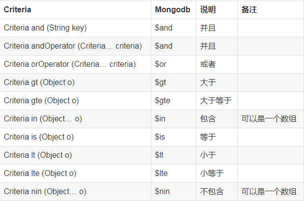

# MongoDB学习记录

## MongoRepository使用
    @Repository
    public interface SysMenuRepository extends MongoRepository<SysMenu,String> {
    
        /**
         * 模糊查询
         * StartsWith    起始位置开始匹配
         * EndsWith      结束位置
         * @param code 匹配内容
         * @return
         */
        List<SysMenu> findByCodeStartsWith(String code);
    
    }
**示例**

    @Service
    public class SysMenuService {
        @Autowired
        private SysMenuRepository sysMenuRepository;
        @Autowired
        private MgRepository mgRepository;
        /**
     * 新增
     * @param sysMenu
     * @return
     */
    public SysMenu save(SysMenu sysMenu){
        return sysMenuRepository.save(sysMenu);
    }

    /**
     * 查询所有并分页
     * @return
     */
    public Page<SysMenu> findAll(Pageable pageable) {
        return sysMenuRepository.findAll(pageable);
    }

    /**
     * 模糊查询所有 分页
     * @param pageable
     * @return
     */
    public Page<SysMenu> findPag(Pageable pageable) {
        SysMenu sysMenu = new SysMenu();
        sysMenu.setCode("e");
        sysMenu.setId("e");
        sysMenu.setPcode("qqqqq");
        Example<SysMenu> example = Example.of(sysMenu,generater());
        return sysMenuRepository.findAll(example,pageable);
    }
    /**
     * 删除
     * @param id
     * @return
     */
    public String delete(String id){
        sysMenuRepository.deleteById(id);
        boolean exists = sysMenuRepository.existsById(id);
        return exists == false ? "1":"0";
    }

    /**
     * StartsWith    起始位置开始匹配
     * EndsWith      结束位置
     * @param code
     * @return
     */
    public List<SysMenu> findByCodeStartsWith(String code){
        return sysMenuRepository.findByCodeStartsWith(code);
    }

    private ExampleMatcher generater() {
        return ExampleMatcher.matching() //构建对象
                .withStringMatcher(ExampleMatcher.StringMatcher.CONTAINING) //改变默认字符串匹配方式：模糊查询
                .withIgnoreCase(true) //改变默认大小写忽略方式：忽略大小写
                .withMatcher("pcode", match->match.exact()) // 精确查询pcode，模糊查询其他
    //                .withMatcher("code", ExampleMatcher.GenericPropertyMatchers.regex()) // 查询
    //                .withMatcher("id", ExampleMatcher.GenericPropertyMatchers.regex()) // 查询
    //                .withMatcher("pcode", ExampleMatcher.GenericPropertyMatchers.regex()) // 查询
                .withIgnoreNullValues();//hu忽略null
    }
    
## MongoTemplate 使用

    public abstract class MongodbBaseDao<T extends Serializable>{

        /**
         * spring mongodb　集成操作类　
         */
        @Autowired
        private MongoTemplate mongoTemplate;
    
        /**
         * 通过条件查询实体(集合)
         *
         * @param query
         */
        public List<T> find(Query query) {
            return mongoTemplate.find(query,this.getEntityClass());
        }
    
        /**
         * 通过一定的条件查询一个实体
         *
         * @param query
         * @return
         */
        public T findOne(Query query) {
            return mongoTemplate.findOne(query, this.getEntityClass());
        }
    
        /**
         * 通过条件查询更新数据
         *
         * @param query
         * @param update
         * @return
         */
        public void update(Query query, Update update) {
            mongoTemplate.upsert(query, update, this.getEntityClass());
        }
    
        /**
         * 保存一个对象到mongodb
         *
         * @param bean
         * @return
         */
        public T save(T bean) {
            mongoTemplate.save(bean);
            return bean;
        }
    
        /**
         * 通过ID获取记录
         *
         * @param id
         * @return
         */
        public T get(String id) {
            return mongoTemplate.findById(id, this.getEntityClass());
        }
    
        /**
         * 通过ID获取记录,并且指定了集合名(表的意思)
         *
         * @param id
         * @param collectionName
         *            集合名
         * @return
         */
        public T get(String id, String collectionName) {
            return mongoTemplate.findById(id, this.getEntityClass(), collectionName);
        }
    
        /**
         * 获取需要操作的实体类class
         *
         * @return
         */
        protected abstract Class<T> getEntityClass();
    
    }
## Criteria 说明

#### 示例:
    /**
     * 使用  Criteria 示例
     * @param id
     * @return
     */
    public SysMenu find(String id){
        Criteria criteria = new Criteria();
        criteria.where("id").is(id);
        Query query = Query.query(criteria);
        return mgRepository.findOne(query);
    } 
详细请看:https://docs.spring.io/spring-data/data-mongo/docs/current/api/org/springframework/data/mongodb/core/query/Criteria.html
